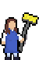
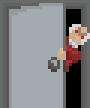
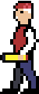
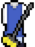

# FEUP-DDJD First Project - Stationery Beatriz: On The Move

## Introduction

“Stationery Beatriz: On The Move” is a platformer game developed in unity for FEUP's curricular unit, Design and development of digital games. In this game, the player “Dona Beatriz”, an employee of FEUP's stationery shop. Your objective is to reach the end while trying not to get caught by teachers and cleaning ladies. To do this, you can make use of different power ups as well as an interactive environment.   

## Team

- Davide Castro - up201806512@edu.fe.up.pt

- Diogo Rosário - up201806582@edu.fe.up.pt

- Henrique Ribeiro - up201806529@edu.fe.up.pt

## Installation

To install this game, please access the following link:

[Inserir link do itch.io]. After doing so, download the executable and run it.

## How To Play

### Controls

- Movement: A/Arrow Left, D/Arrow Right;

- Jump: Space;

- Climb Ladder: W/Arrow Up;

- Descend Ladder: S/Arrow Down;

- Throw Banana: J;

- Throw Pen: K;

- Thrust Ruler: L;

- Deploy Glider: Shift;

### Enemies

| Enemy Sprite | Description   |

|:---:|---|

|   | **Cleaning Lady:** Walks back and forth inside a designated area. If the player touches her, the player loses. The player can distract the cleaning lady by throwing a banana inside her cleaning area.  |   

|   | **Door Professor:** Peeks through the door from time to time to see if it can detect the player. If a box is pushed in front of the door, it will no longer open.

|  

|   | **Thrower:** Periodically throws pencils. These pencils travel until a wall/box is hit.| 

### Power Ups

| Power Up Sprite | Description   |

|:---:|---|

|   | **Disguise:** Gives the player a disguise to not get caught for one time.  |   

|   | **Banana:** Gives a banana to a player to distract the cleaning lady

|  

|   | **Pencil:** Gives a pencil to the player to throw it at enemies.| 

|   | **Paper Plane:** Gives the player the ability to glide. By holding "shift" while airborne, the player deploys a paper airplane that reduces the speed at which the player falls, but does not stop going forward/backwards.| 

|   | **Ruler:** Gives a ruler to the player to thrust it at enemies. Each ruler can be used to defeat up to two enemies. After defeating two enemies, the ruler breaks and the player needs to pick up another one.| 

## Assets
### Font
[Free Pixel Font](https://assetstore.unity.com/packages/2d/fonts/free-pixel-font-thaleah-140059)
### Sprites

Most of the sprites were made by the team. The only sprite not done by the team was the smoke the enemies leave behind, the banana and the ladders.

- Smoke: [https://opengameart.org/content/smoke-fire-animated-particle-16x16](https://opengameart.org/content/smoke-fire-animated-particle-16x16)

- Ladder: [https://opengameart.org/content/dungeon-crawler-tiles](https://opengameart.org/content/dungeon-crawler-tiles)

- Banana: [https://opengameart.org/content/good-fruits-m484-games](https://opengameart.org/content/good-fruits-m484-games)

### Sound effects

All sound effects were obtained through open game art.

The ones that were not open domain can be found in the following links:

- Smoke Sound: [https://opengameart.org/content/poof-noises](https://opengameart.org/content/poof-noises)

- Pressure Plate : [https://opengameart.org/content/click-sounds6](https://opengameart.org/content/click-sounds6)

- Jumping Sound: [https://opengameart.org/content/platformer-jumping-sounds](https://opengameart.org/content/platformer-jumping-sounds)

- Background Music: [https://www.chosic.com/free-music/games/](https://www.chosic.com/free-music/games/)

## Some Highlights

Since most sprites used in the development of the game were made by the team, the game features never seen before art. On top of that, every sprite is coupled with a set of animations to give more accurate visual feedback to the player. 

### Development Highlights

The initial development was a bit slow as the team did not have much experience with unity. However, this did not last too long as the team grew accustomed to the platform relatively fast.

To design new levels and adjust the enemies to their conditions, their ranges and some other details were “Serialized”, this means, these aspects could be edited for each individual enemy. For example, the door enemy. The range in which the player is detected by this enemy can be adjusted for each instance of this enemy, and the indicator above the door will also self adjust to match the new range.